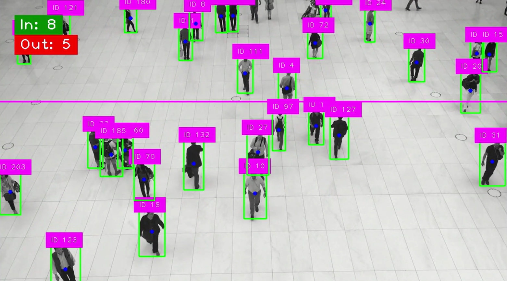

# AI Assignment: Footfall Counter using Computer Vision

## Objective
Develop a computer vision-based system that counts the number of people entering and exiting through a specific area (doorway, corridor, or gate) in a video. This demonstrates your understanding of AI model integration, tracking logic, and end-to-end problem-solving.

## Dependencies
- **Flask** - Web framework for the application interface
- **Flask-CORS** - Cross-Origin Resource Sharing for Flask
- **OpenCV** (opencv-python) - Computer vision and video processing
- **NumPy** - Numerical computing and array operations
- **Ultralytics** (ultralytics) - YOLOv8 implementation
- **cvzone** - Computer vision utility functions

## Directory Structure
```
footfall-counter/
│
├── static/                  
│   ├── uploads/            
│   └── outputs/          
│
├── templates/             
│   └── index.html         
│
├── app.py                 
├── main.py               
├── counter.py           
└── requirements.txt      
```

## Screenshots

### Upload Interface

*Video upload page with orientation and line position inputs*

### Results View

*Processed video with entry/exit counts and tracking visualization*

## Processed Video Demo
[Watch processed demo video on Google Drive](https://drive.google.com/file/d/1j-T26NFZyvn3kUw0DaaBSIyVTNhUMho1/view?usp=sharing)
*Sample output showing people detection, tracking, and counting visualization*

## Approach
1. **Detection:** YOLOv8 detects humans in each frame of the video.
2. **Tracking:** YOLOv8 assigns unique IDs to detected people and tracks them across frames.
3. **Counting Logic:** 
   - User provides a **line orientation** (horizontal or vertical) and **line position** (pixel coordinate) via a web interface.
   - The `FootfallCounter` class tracks IDs and counts entries/exits when they cross the defined line based on their centroid.
4. **Visualization:** Bounding boxes, IDs, line, and in/out counts are drawn on each frame. The processed video is saved and accessible via the web interface.

## Counting Logic
- Horizontal line → counts people moving **up/down**
- Vertical line → counts people moving **left/right**
- Each person is counted **only once** per crossing
- `FootfallCounter` stores previous positions of IDs to detect line crossing direction.

## Setup & Installation

### 1. Clone Repository
```bash
git clone https://github.com/Nidhin-jyothi/Footfall-Counter.git
```

### 2. Create Virtual Environment
```bash
python -m venv env
source env/bin/activate      # Linux/macOS
env\Scripts\activate         # Windows
```
### 3. Install Dependencies
```bash
pip install -r requirements.txt
```

## Usage
Web Interface

### 1. Run Flask:
```bash
python app.py
```
### 2. Open browser:
```bash
http://localhost:5000
```

### 3. Upload video.

### 4. Enter line orientation (horizontal or vertical) and line position (pixel coordinate).

### 5. Click Submit.

### 6. View processed video, entry/exit counts.